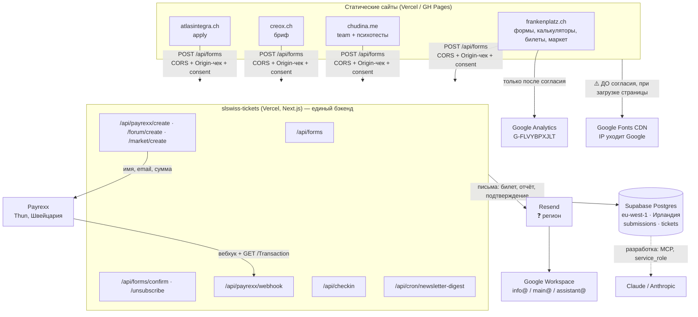

# Защита данных на платформе Creox — реестр обработки

> Собрано 2026-08-06 по **коду**, а не по памяти: схема БД, роуты `app/api/*`, `lib/forms.js`,
> статические сайты в `Downloads/creox/*`, регионы проектов Supabase (через API).
> Что проверено и как — отмечено по ходу. Что НЕ проверено — помечено ❓.
>
> ⚠️ **Это не юридическая консультация.** Документ описывает фактическую архитектуру
> и даёт структуру для юриста. Тексты Datenschutzerklärung / DPA перед публикацией
> должен посмотреть человек с швейцарской юр-квалификацией.
>
> ⚠️ Сайты читались из локальных папок `Downloads/creox/*`. Они могут отличаться от
> задеплоенных версий — перед фиксацией «сделано» сверять с продом.

Соседние файлы:
- [`PROCESSORS.md`](PROCESSORS.md) — реестр поставщиков (кто, где, что видит, есть ли DPA)
- [`TOMS.md`](TOMS.md) — технические и организационные меры (что уже реально в коде)
- [`CLIENT-CHECKLIST.md`](CLIENT-CHECKLIST.md) — чек-лист перед запуском автоматизации у клиента
- [`DOC-TEMPLATES.md`](DOC-TEMPLATES.md) — скелеты документов (политика, DPA, инцидент, запрос субъекта)

---

## 1. Роли: кто контролёр, кто процессор

| Проект | Кто решает «зачем и как» (Controller) | Кто обрабатывает по поручению (Processor) |
|---|---|---|
| frankenplatz.ch (форум, билеты, маркет, калькуляторы) | **Kseniia Chudina Art+Event**, Bäderstrasse 28, 5400 Baden — так указано в `Legal.jsx` | Supabase, Resend, Payrexx, Vercel, Google (Analytics, Workspace) |
| chudina.me | Kseniia Chudina Art+Event ❓ (в `datenschutz.html` контролёр указан — сверить, что то же юрлицо) | те же |
| creox.ch | Creox / то же юрлицо ❓ — уточнить, отдельное ли это лицо | те же |
| atlasintegra.ch | **Verein Atlas Integra** ❓ — это отдельное юрлицо, значит и контролёр отдельный | те же + Creox как процессор |
| CashFlow Cabinet (cashflow.chudina.me) | Kseniia Chudina Art+Event ❓ | Supabase, Vercel |
| MOTO-ZÜRICH | ❓ клиент (внешний) — тогда **Creox = процессор**, нужен DPA с клиентом | GitHub Pages |
| Будущие клиентские проекты | клиент | **Creox = процессор** → DPA обязателен |

**Главное следствие.** Внутри платформы почти везде контролёр — одно и то же лицо, поэтому
DPA между «своими» не нужен. Но `atlasintegra` (Verein) и внешние клиенты — **другие контролёры**,
и их данные лежат в **той же таблице `submissions`**, что и данные форума. Это самая
неудобная точка всей конструкции: одна база на разных контролёров.

Варианты (выбирать надо осознанно):
1. **Оставить как есть + DPA.** Creox выступает процессором для Verein/клиента, разделение —
   логическое (`source`), доступ ограничен. Дёшево, но в DPA придётся честно написать, что
   хранилище общее.
2. **Разделить по проектам** (отдельный Supabase-проект на внешнего контролёра). Чисто
   юридически, но ломает «единую базу аудитории» — решение 2026-07-10 принималось ровно против этого.
3. **Разделить только на уровне доступа** (RLS-политики/views по `source`, отдельные ключи).
   Компромисс: одна база, но никто не видит чужого.

Я бы начал с (1) + подготовил (3) — но это ваш выбор, не мой: он завязан на то,
насколько Verein и клиенты формально самостоятельны.

---

## 2. Какие персональные данные реально обрабатываются

Сверено с `supabase-schema.sql` и живой БД (проект `dwcmiommviauwzkhkbki`, регион **eu-west-1**, Ирландия).

### `public.submissions` — заявки и лиды со всех сайтов (34 строки на 2026-08-06)

| Поле | Что это | Чувствительность |
|---|---|---|
| `name`, `email`, `telegram`, `phone` | контакт | обычные перс. данные |
| `source`, `form_key`, `source_url`, `event` | с какого сайта/формы/страницы | метаданные, но связаны с личностью |
| `payload` (jsonb) | **все поля формы** — включая сводки калькуляторов форума («Пенсия, CHF/мес», бюджет, налоги, аренда vs покупка) | **финансовые данные конкретного человека** — по revDSG не «особо ценные», но по факту чувствительные |
| `tests` (jsonb) | результаты психотестов: жизнестойкость по Мадди, роль в команде PAEI (Адизес) — форма `team` на chudina | **оценка личности** — ближе всего к «особо ценным»; нужен явный отдельный смысл согласия и узкий доступ |
| `consent` (bool) + `created_at` | согласие и момент его дачи | доказательство законности всей обработки |
| `status` | воронка + `pending/confirmed/unsubscribed` для рассылки | — |

### `public.tickets` — билеты (3 строки)

`buyer_email`, `buyer_name`, `amount`, `currency`, `payrexx_tx_id`, `qr_token`,
`payload` (день, категория, ланч, **телефон** — для форума и маркета), `paid_at`, `checked_in_at`, `ticket_no`.

`checked_in_at` = **факт присутствия человека в конкретном месте в конкретное время**.
Мелочь, а по сути данные о перемещении — стоит упомянуть в политике отдельно.

### Прочее в той же базе

`profiles`, `events`, `services`, `tasks`, `transfers`, `referrals`, `articles` — **0 строк**,
не используются. Либо удалить, либо явно записать «зарезервировано, данных нет»:
пустая таблица `profiles` с FK из `submissions.profile_id` иначе выглядит как скрытый профиль.

### Второй проект Supabase

`chudina-cashflow` (`vlwlbfxnloyrzxogjdog`), регион **eu-central-1** (Франкфурт), статус **INACTIVE** (на паузе).
Данные участников игры CashFlow — ❓ что именно там лежит и надо ли это ещё хранить, я не проверял
(проект приостановлен). Игра прошла 23 августа → это первый кандидат на удаление по сроку.

---

## 3. Карта потоков данных

Словами, по цепочкам:

1. **Заявка с формы:** браузер → `POST /api/forms` (Origin-чек, honeypot, time-trap, обязательный `consent`)
   → `submissions` (Supabase, Ирландия) → письмо-уведомление через Resend → ящик Google Workspace.
   Плюс, по типу формы, письмо самому человеку (отчёт калькулятора / регистрация / спикер / Оказия / double opt-in).
2. **Покупка билета:** `/forum/create` → строка `tickets` (pending) → Payrexx (Швейцария) → оплата →
   вебхук → проверка `GET /Transaction` → `paid` → QR + письмо через Resend.
3. **Вход на событие:** `/scan` → `/api/checkin` → `checked_in_at`.
4. **Рассылка:** double opt-in (только форум) → `confirmed`; дневная сводка подписчиков
   уходит письмом через `/api/cron/newsletter-digest`.
5. **Разработка:** агент Claude Code имеет доступ к боевой БД через Supabase MCP с правами
   service_role. Формально это ещё один канал обработки — см. §6.

---

## 4. Трансграничная передача

Швейцария → ЕЭЗ: ЕС в списке стран с адекватной защитой по швейцарскому праву,
поэтому Ирландия/Франкфурт — **самый спокойный участок цепочки**.

| Куда уходит | Что уходит | Оценка |
|---|---|---|
| **Supabase, Ирландия (eu-west-1)** | всё: заявки, билеты, психотесты, финсводки | ЕЭЗ — ок. ❓ Но материнская Supabase Inc. — США; проверить, что в DPA стоят SCC для доступа поддержки из США |
| **Payrexx, Thun (CH)** | имя, email, сумма | данные не покидают Швейцарию — лучший случай |
| **Vercel (США, Inc.)** | проходящий трафик, логи функций (могут содержать email в ошибках) | США → нужны SCC + Swiss addendum. ❓ Проверить, доступен ли DPA на плане **Hobby** |
| **Resend** | **содержимое всех писем**: билеты, отчёты с финрасчётами, контакты | ❓ регион хранения и срок хранения логов писем не проверены. Это фактически второе хранилище персданных |
| **Google (Workspace, Analytics, Fonts)** | почта, аналитика, IP при загрузке шрифтов | США → SCC. Analytics — только после согласия ✅. **Fonts — ДО согласия ❌** |
| **Anthropic (Claude)** | при разработке — то, что агент читает из БД | внутреннее правило нужно, см. §6 |

---

## 5. Что уже сделано хорошо (не переделывать)

Проверено по коду — см. подробности в [`TOMS.md`](TOMS.md):

- ✅ Заявка **без согласия не сохраняется** (`app/api/forms/route.js:109`), `created_at` = момент согласия.
- ✅ RLS включён на `tickets` и `submissions`, **ни одной policy для anon** — из браузера база недоступна.
- ✅ Отозваны лишние гранты TRUNCATE у `anon`/`authenticated`, инвариант закреплён pgtap-тестом.
- ✅ Double opt-in на рассылку форума + `List-Unsubscribe` (one-click) + роут отписки.
- ✅ Полные данные карты к нам не попадают — платит человек на стороне Payrexx.
- ✅ Подпись вебхука fail-closed, цена только серверная, ключ персонала на чек-ин.
- ✅ Cookie-баннер с Consent Mode: GA грузится **только** после «Принять» (chudina, frankenplatz).
- ✅ Жёсткий Origin-чек + honeypot + time-trap — меньше мусорных персданных в базе.

---

## 6. Пробелы — по приоритету

### 🔴 Высокий (делать в ближайший спринт)

1. **Нет ни одного механизма удаления.** Ни у `submissions`, ни у `tickets`, ни у брошенных
   `pending`-билетов. Проверено: cron-роут только один — `newsletter-digest`, он ничего не удаляет;
   отписка лишь меняет `status` на `unsubscribed`, строка с email остаётся навсегда.
   → Нужна политика сроков (§7) + cron-роут удаления/обезличивания.
2. **atlasintegra.ch собирает персданные (`apply.html` → `/api/forms`) без политики
   конфиденциальности.** Проверено двумя способами: нет файлов `datenschutz/impressum/privacy`
   и нет ни одного упоминания в контенте (единственное совпадение `privacy` — имя CSS-класса).
   → Либо страница политики, либо снять форму.
3. **Datenschutzerklärung форума не называет ни одного поставщика.** В `Legal.jsx` §4 —
   «платёжный провайдер / сервис рассылок / хостинг» без имён, и **Google Analytics не упомянут
   вообще**, хотя `cookie-consent.js` грузит `G-FLVYBPXJLT`. Текст и поведение обязаны совпадать —
   это же требование записано в комментарии самого модуля.
   → Вписать: Payrexx, Supabase, Resend, Vercel, Google Analytics, Google Workspace.
4. **Google Fonts грузятся с CDN Google на всех пяти сайтах** (13 подключений на chudina,
   9 на frankenplatz, 6 atlasintegra, 4 creox, 2 cashflow) — IP посетителя уходит в Google
   **до** любого согласия. Самое дешёвое исправление во всём списке: self-host шрифтов.
5. **Психотесты (`tests`) обрабатываются без отдельного согласия.** Общая галочка
   «согласен на обработку» на форме `team` не покрывает оценку личности.
   → Отдельный чекбокс + прямое упоминание в политике chudina.

### 🟡 Средний

6. **Нет процедуры на запросы субъектов** (доступ / исправление / удаление). Сейчас это ручной SQL.
   → Регламент + подготовленные запросы (шаблон в `DOC-TEMPLATES.md`).
7. **Нет процедуры на инцидент.** revDSG требует уведомить EDÖB «как можно скорее».
   → Одностраничный runbook: кто решает, кого уведомляем, в какой срок.
8. **Доказательство согласия слабое.** Хранится только `consent=true` + время. Не хранится,
   *с какой формулировкой* человек согласился.
   → Добавить `consent_version` (или писать текст согласия в `payload`).
9. **Подписки не с форума записываются без double opt-in** (`app/api/forms/route.js:128` —
   условие включает `sub.source === 'forum'`). Для creox это значит контакт в базе без
   подтверждения владения адресом.
10. **Resend как хранилище.** Содержимое писем (включая финрасчёты и QR-билеты) лежит у Resend.
    → Проверить срок хранения логов/писем в аккаунте и указать Resend в политике.
11. **Vercel Hobby под коммерческой продажей билетов.** ❓ Проверить ToS (Hobby часто ограничен
    некоммерческим использованием) и доступность DPA на этом плане. Если DPA только с Pro —
    это не «когда-нибудь», а условие легальности.
12. **Vercel-логи функций.** `console.error` в роутах может выносить в логи содержимое ошибок.
    → Убедиться, что в логи не попадают email/payload; при необходимости — маскировать.

### 🟢 Низкий / гигиена

13. Пустые таблицы `profiles/events/services/tasks/transfers/referrals/articles` — удалить или задокументировать.
14. Тестовая строка `test-forum-pilot@example.com` в `submissions` (висит с 15.07) — убрать.
15. `chudina/cookie-consent.js` показывает баннер, но `GA_ID` пуст → согласие спрашивается
    за аналитику, которой нет. Либо включить GA, либо убрать пункт из текста баннера.
16. Файл `client_secret_*.apps.googleusercontent.com.json` (Google OAuth) лежит открыто
    в `Downloads/creox/`. В репозиторий не попал, но это боевой секрет в общей папке — убрать в менеджер паролей.
17. Данные игры CashFlow в приостановленном проекте Supabase — решить: удалять или хранить и зачем.

---

## 7. Сроки хранения — предлагаемая политика

Сейчас не реализовано ничего, поэтому это стартовая рамка под ваше решение (юрист может поправить):

| Категория | Предложение | Основание |
|---|---|---|
| `tickets` оплаченные (сумма, дата, покупатель) | **10 лет** | бухгалтерская обязанность (OR 958f) |
| `tickets` в статусе `pending` (брошенные корзины) | **7 дней** → удалять | цели больше нет |
| `submissions` — заявки/лиды без сделки | **24 месяца** с последнего контакта | законный интерес, разумный горизонт |
| `submissions` — подписка `confirmed` | до отписки + **12 мес** в suppression-листе | доказать, что отписку исполнили |
| `submissions` — `unsubscribed` | оставить **только хэш email**, остальное стереть | минимизация |
| `payload` калькуляторов (финсводки) | **12 месяцев** → обезличить (оставить агрегат) | самые чувствительные, короткий срок |
| `tests` (психотесты) | **12 месяцев** или до решения по кандидату | оценка личности хранится не «на всякий случай» |
| `checked_in_at` | **12 месяцев** после события | данные о присутствии |
| Логи Vercel / письма Resend | по настройкам провайдера — **проверить и зафиксировать** ❓ | — |

Реализация: один cron-роут `/api/cron/retention` по образцу `newsletter-digest`
(тот же `CRON_SECRET`, тот же паттерн 503 без секрета), плюс запись в лог, что и когда удалено.

---

## 8. Какие документы нужны

| Документ | Статус | Где |
|---|---|---|
| Datenschutzerklärung frankenplatz | 🟡 есть, но без имён поставщиков и без GA | `frankenplatz/site/Legal.jsx:130` |
| Impressum + AGB frankenplatz | ✅ есть | там же |
| Datenschutz/Impressum/AGB creox | 🟡 есть (внутри i18n в `index.html`), названы Vercel и Supabase; **нет Resend** | `creox/index.html` |
| Datenschutz/Impressum/AGB chudina | 🟡 есть (`datenschutz.html`), названы Supabase, Resend, Vercel, США | `chudina/files/chudina_me_site/` |
| Datenschutz atlasintegra | ❌ **нет**, при этом форма собирает данные | — |
| Datenschutz cashflow | ❌ нет | — |
| Реестр обработки (RoPA) | 🟡 этот файл + `PROCESSORS.md` = черновик | здесь |
| TOMs | ✅ [`TOMS.md`](TOMS.md) | здесь |
| DPA с поставщиками | ❓ не проверено ни по одному | см. `PROCESSORS.md` |
| DPA с Verein Atlas Integra / клиентами | ❌ нет | шаблон в `DOC-TEMPLATES.md` |
| Процедура запроса субъекта | ❌ нет | шаблон в `DOC-TEMPLATES.md` |
| Процедура инцидента (EDÖB) | ❌ нет | шаблон в `DOC-TEMPLATES.md` |

---

## 9. Про revDSG и GDPR разом

Практика простая: у вас швейцарское лицо, сайты на русском и немецком, аудитория —
русскоязычные в Швейцарии, но заявки приходят и из ЕС. Значит, применяются **оба режима**,
и настраиваться надо по более строгому.

Где GDPR строже и это касается вас:
- **Явное информирование о сроках хранения** (revDSG мягче — GDPR требует конкретики). → §7.
- **Правовое основание** должно быть названо для каждой цели (в `Legal.jsx` §3 это уже сделано — хорошо).
- **Уведомление о нарушении в 72 часа** (revDSG — «как можно скорее», без жёсткого числа). Ориентируйтесь на 72 ч.
- **Реестр обработки** формально обязателен при определённых порогах; при вашем масштабе,
  скорее всего, не обязателен — но заведён (этот файл), и это правильно.
